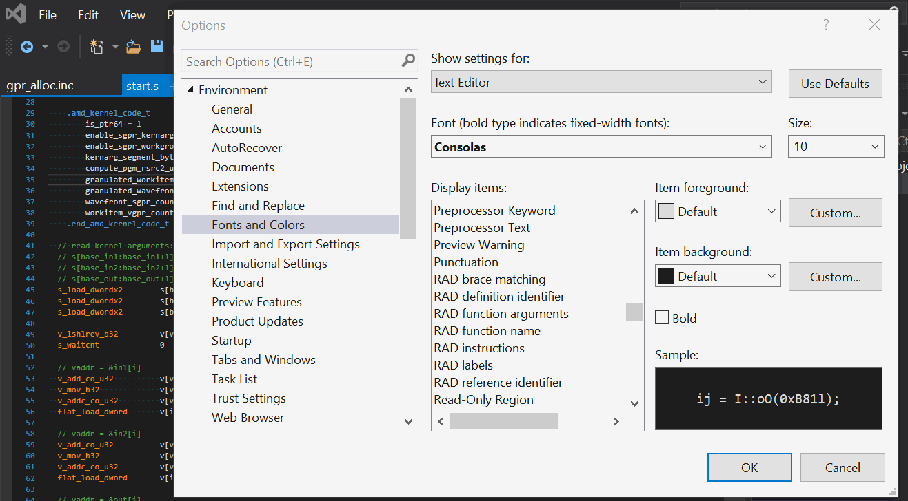
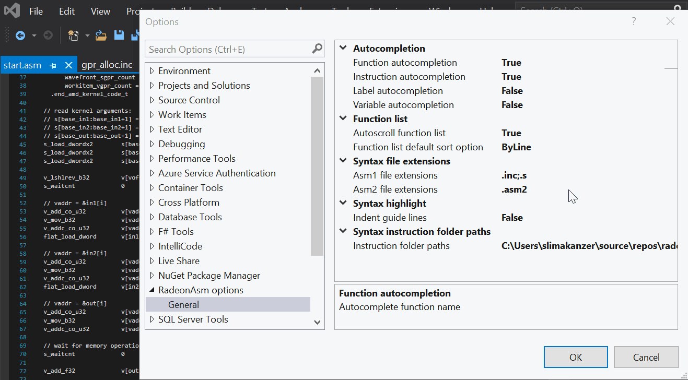
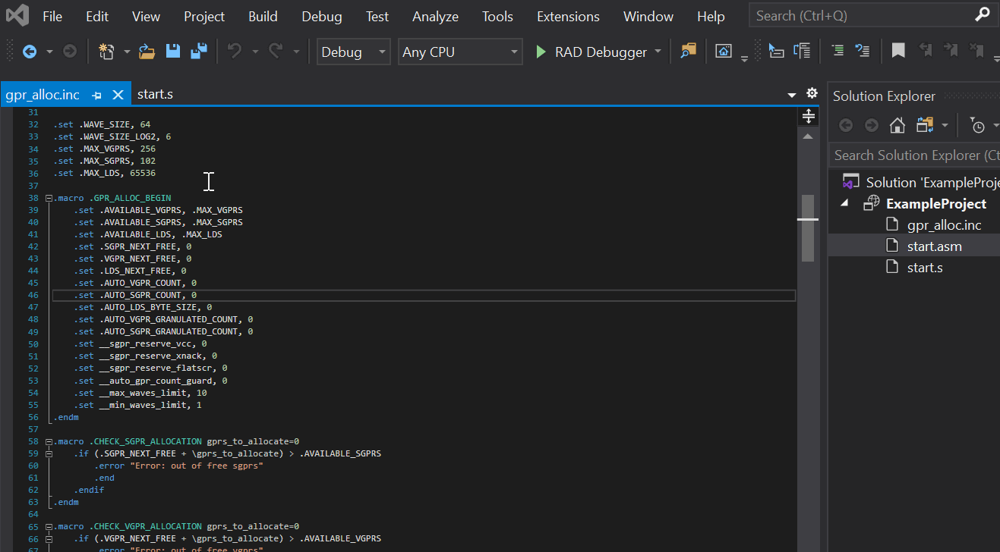
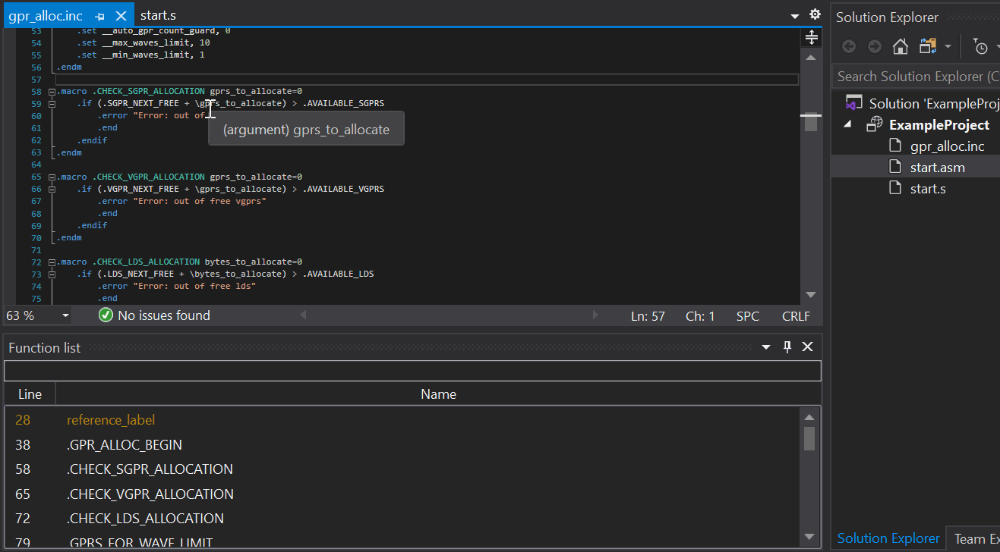
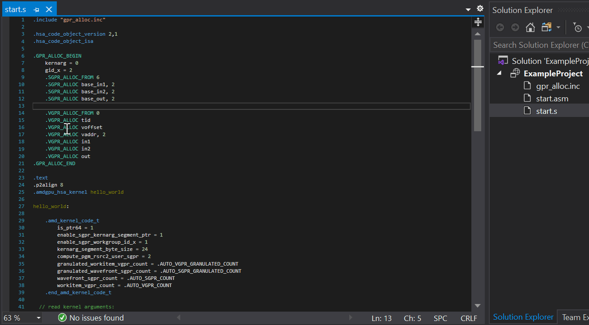
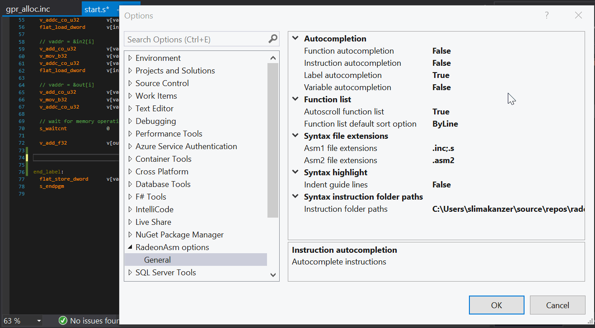
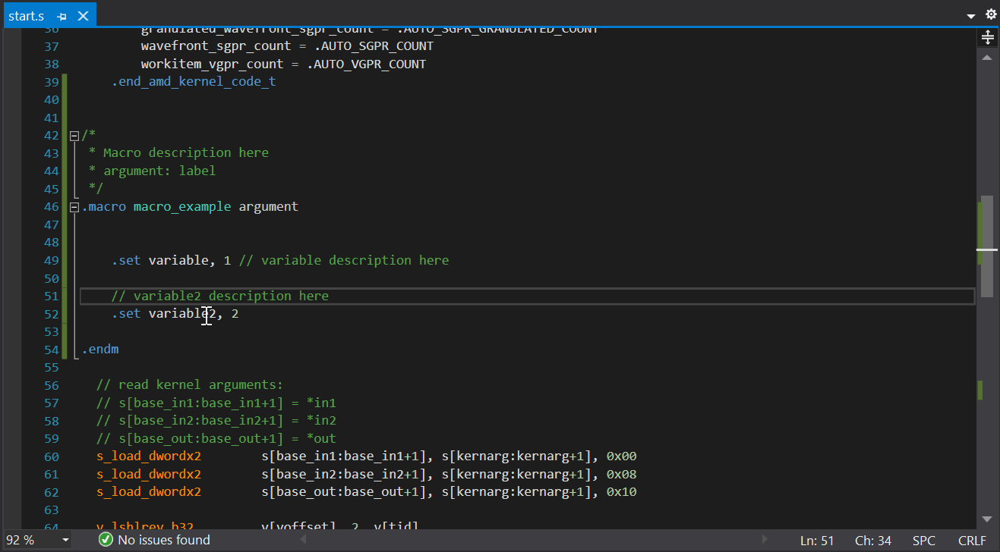
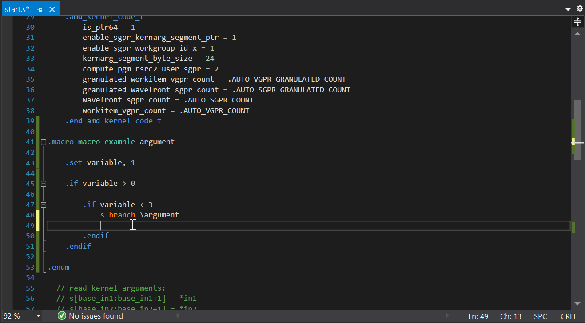
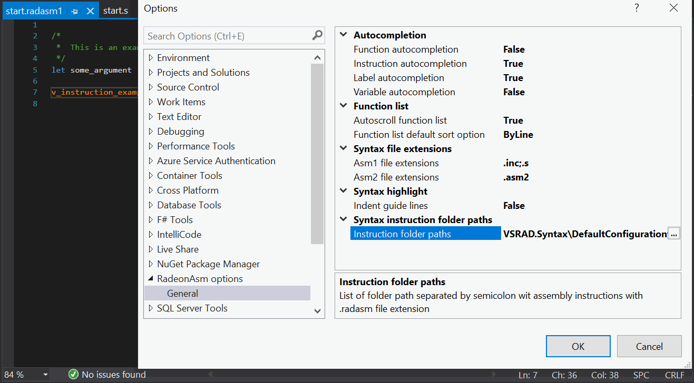
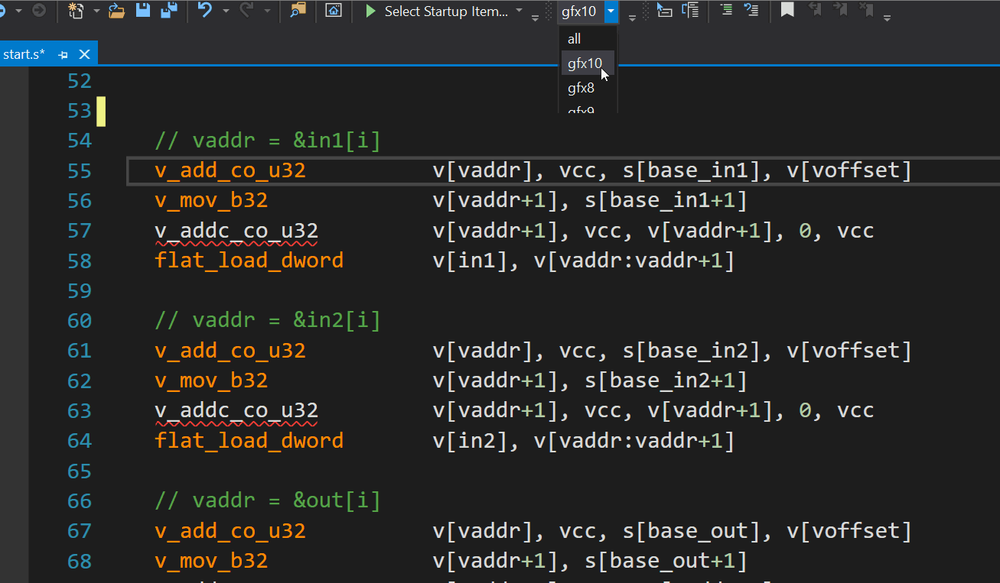

# Visual Studio Radeon Asm Syntax Highlight Extension

## Build Instructions

Make sure you have [.NET Framework SDK 4.8](https://dotnet.microsoft.com/download/visual-studio-sdks) installed on your development workstation.

To build extension you should use one of four project build options:
* `Debug` - debug version with *Radeon asm* support
* `Release` - release version with *Radeon asm* support

> For example, for the `Release` build option, the `RadeonAsmSyntax.vsix` extension installer will be located in the ***path to project location\VSRAD.Syntax\bin\Release*** directory.

## Debugging

1. Right-click on `VSRAD.Syntax` in *Solution Explorer* and select *Set as StartUp Project*.
2. Right-click on `VSRAD.Syntax` in *Solution Explorer* and
select *Properties*.
4. Navigate to the *Debug* tab in the project properties editor.
5. Choose *Start external program* as the *Start action* and enter the path to your Visual Studio executable (`<Visual Studio installation path>\Common7\IDE\devenv.exe`).
6. Close the project properties editor and start debugging by pressing F5.

## Plugin features

### Radeon asm syntax colors

Defined colors:
* RAD function name
* RAD function arguments
* RAD instructions
* RAD labels
* RAD definition identifier
* RAD reference identifier
* RAD brace matching

### File extensions
User can define file extensions, which will be displayed as RadeonAsm1 syntax or RadeonAsm2 syntax.

### Error highlight (only with debugger extension)

  

### Function list
 * Tool window location is `View -> Other Windows -> Radeon Asm Function List`

* The function list is filtered by text in search field.
* Use *Up* or *Down* in order to scroll through the function list.
* Use *Line* or *Name* buttons to sort function list by line number or function name.
* Click *RMB* to **Show/Hide** line number column.
* If the cursor is in the function scope, then it will be highlighted.
* Function List will automatically scroll when cursor moves to another function.
  > To disable autoscroll: `Tools -> Options -> RadeonAsm options -> set Autoscroll function list to false`
* Use *clear hotkey* to clear the search field. To 
  > To set clear special hotkey: `Tool -> Options -> Environment, Keyboard -> find command "FunctionList.Clear" and set shortcut keys`.
* *Enter*, *redirect hotkey* or *click on the function in list* redirect to a function in code.
  > To set redirect special hotkey: `Tool -> Options -> Environment, Keyboard -> find command "FunctionList.Select" and set shortcut keys`.

### Code navigation
* Navigation to `macros`, `variables`, `labels` and `macro arguments`.
* Navigation to external definitions using `.include` or `#include` supported.
* `Peek Definition` and `GoTo Definition` supported.

### Intellisense
* Autocompletion supported for variables, functions, labels and instructions.
* Autocompletion can be enabled or disabled.
 > `Tools -> Options -> RadeonAsm options -> Autocompletion -> set true to enable and false to disable for specific token type`

 

* *Quick info* feature is supported. When you hover over an element, tooltip with information about the element is shown.
* If the comment is to the right of the element or above, then it will be shown in the tooltip.
* The default value of variables can be displayed, if any.

 

### Identifier highlight
* Highlighting an element in its scope.

### Instruction list
The instruction documentation is stored in files with `.radasm1` or `.radasm2` extensions. When installing the extension, the default documentation for `asm1` instructions will be added.

* User can add his own instruction documentation.
 > To add documentation: `Tools -> Options -> RadeonAsm options -> Instruction folder paths -> add paths to directory with .radasm1 or .radasm2 files separated by semi-colon`
* Intellisense will work with new instructions.
* User can navigate through the documentation as with source files.

### Instruction set selector
* The user can choose instructions set to highlight the instruction.
* If the instruction belongs to another set, then it will be highlighted as an error.
* The instruction set drop-down menu can be found at
  > `View -> Toolbars -> Instruction Set`

### Other features
* Comment/Uncomment block
* Indent guide lines for block scopes
 > `Tools -> Options -> RadeonAsm options -> enable or disable Indent guide lines`
 > 

* Function list default sort options (when opening a window)
 > `Tools -> Options -> RadeonAsm options -> Function List default sort options`